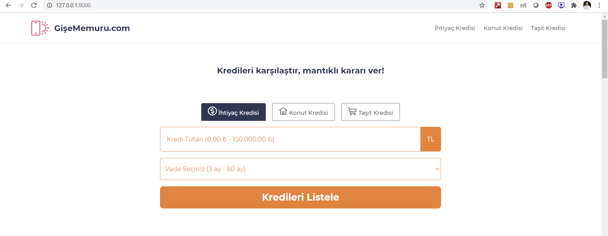
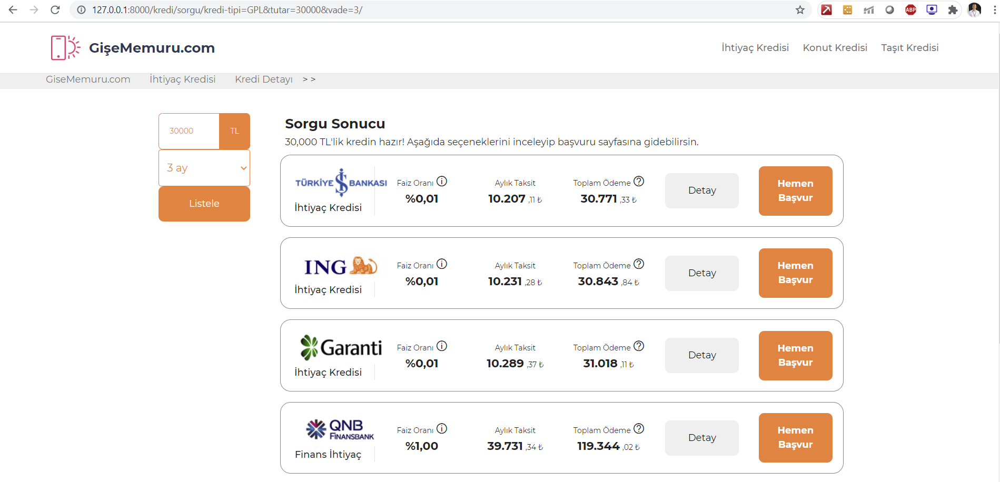
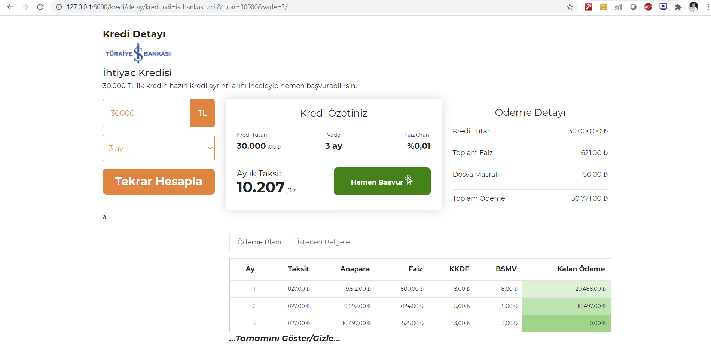

Screenshots:

### 22Jun Update:
- Loans app created. Find details in Trello --> Backend Tasks --> Create Models in Django
- loan_list and loan_detail views created.
- App redirects from loan_list to loan_detail with required arguments.
- Next on deck: implement dropdown on forms, create activity log and blog apps.

### 23Jun Update:
- Blog app created. Find details in Trello --> Backend Tasks --> Create Models in Django
- blog_index_page and blog_page views created.
- Wagtail CMS integrated with the project. Go to localhost:8000/cms
- Wagtail is used for easy adding & editing content (blog posts in our case.)
- Next on deck: implement dropdown on forms, create activity log.

### 24Jun Update:
- New models created. Find details in Trello --> Backend Tasks --> Create Models in Django
- Next on deck: create log tables, implement dropdown on forms, create activity log.

### 25Jun Update:
- Working on logging logic.. will explain tomorrow.

### 26Jun Update:
- DB for loans has been finalized. Some rusts to be fixed on demand.
- Logging logic:
    - tables loans_loan, loans_loandetail and loans_link are logged. just append "log" at the end for each table.
    - there are three actions possible for logging: INSERT, UPDATE, and DELETE.
    - Log related fields are the following:
        - _user    : username of the person who made the change & insertion & deletion.
        - _program : from which source has the change made (admin panel / script etc.)
        - _action  : INSERT, UPDATE, or DELETE
        - _upd_time: timestamp
    - Log fields except _action are present in original tables as well.

### 29Jun Update:
- Form related front-end learnings. Nothing visible yet but there are some progress.

### 30Jun Update:
- Homepage Front-end LoanRequestForm constructed. CSS & styling edits.

### 1Jul Update:
- Homepage Front-end LoanRequestForm edited so that there is only 1 form now - eliminated duplicate div ids etc. CSS & styling edits.
- Blog section integrated with templates on Homepage.
- Next on deck: Build loan_list template

### 2Jul Update:
- Scraping db is created according to @Enes' plan.
- LoanSummary model has been created. This table will directly be used in production and refreshed everytime Loan table changes (though, this process is not ready yet).
- Next on deck: Build loan_list template

### 6Jul Update:
- Working on HTML inheritance between pages. Here is how it is used:
    - home/base.html: is the base page for every page of ours.
    - home/index.html: extends base.html and fills with blocks. Some blocks may be global and some may be local, e.g. menu, javascripts, footer are global and loan request section is local.
    - every other app must extend home/base.html and include global blocks. local blocks are supposed to be created in related app folders.

### 7July Update:
- Loan query result page front-end is being shaped. 1-2 days to go.

### 8July Update:
- Loan query result page front-end is being shaped. 1-2 days to go.

### 9July Update:
- Loan query result page front-end is done (add-ons tbd).
- Loan detail page front-end is under development. 2-3 days to go.

### 9July Update:
- Loan detail page front-end is under development. 2-3 days to go.

### 12July Update:
- Loan detail page front-end is under development. 1 day to go.

### 13July Update:
- Loan detail page front-end is under development.
- Loan Request panel on loan detail page is working inefficiently. The url needs to be changed to slug instead of loan id
- Tooltips to info icons added on loan list page.

### 14July Update:
- The url on detail page changed to slug instead of loan id
- Working on the min-max principal and tenure settings

### 14July "GECE MESAİSİ" Update:
- Limit setting on the principal and tenure is done!

### 15July Update:
- show/hide button on payment_plan is working properly. it will show first 10 rows initially.
- loan summary dataframe is inserted to loans_loansummary table. this will be a cronjob in production to run everyday.
- next item: display loan summary in homepage

### 22July Update:
- SEO module created with FAQItem model.
- FAQ html template inserted in homepage.
- next item: display loan summary in homepage

### 11August Update:
- Batch commit after some holiday.
- Loan Summary Table finished with query section. Loan summary table is populated everyday in loans_loansummary table.
- Loan Matrix Table finished (href is still todo):
    - loans_loanmatrix
    - loans_loanmatrixtable
    - These two tables are populated using loans_loan table everyday. The reason why we have 2 tables in place is that creating matrix dynamically would be very costly in the server side, and it would require js work in the client side. Therefore, I decided to write the table's HTML form directly in the daily job. So, we have an organized table called loans_loanmatrix and a HTML table version of it in loans_loanmatrixtable.
- Featured loans are created. Two columns added to loans_loan table; 1- is_featured (bool) and 2- feature_order (integer). This widget still has some work to do like setting up the Ajax query path and rendering the widget using the url.

ALL THE SCRIPTS THAT I SAY "RUNS EVERYDAY" IS PLACED IN SCRIPTS/JUPYTER PATH RIGHT NOW. THEY WILL BE TRANSFERRED TO SCRIPTS/PY FOLDER IN PRODUCTION.